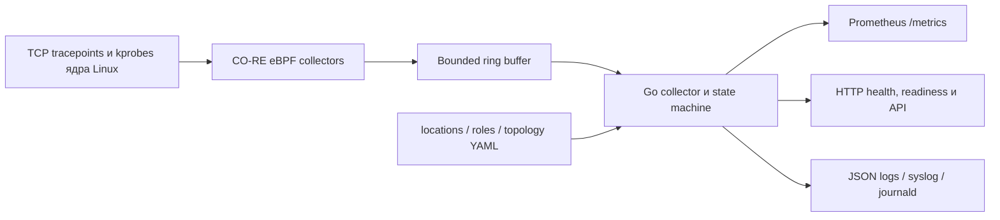

# Network Monitor

[](https://github.com/vponomarev/network-monitor/actions/workflows/ci.yml)
[](https://github.com/vponomarev/network-monitor/actions/workflows/release.yml)
[](LICENSE)

Network Monitor — набор Linux-сервисов для наблюдения за TCP на уровне ядра.
CO-RE eBPF-программы фиксируют ретрансляции и изменения состояния TCP-сокетов,
а Go-сервисы обогащают события метаданными, публикуют Prometheus-метрики и
структурированные журналы.

Проект отвечает на два практических вопроса:

- между какими узлами, ролями или площадками происходят TCP-ретрансляции;
- какие TCP-соединения устанавливаются и закрываются, в каком направлении и
  каким процессом они были созданы.

> `netmon_tcp_loss_total` измеряет TCP-ретрансляции — надёжный симптом потерь
> или деградации, но не универсальный счётчик всех потерянных IP-пакетов.
> `conntrack` наблюдает lifecycle TCP-сокетов и не заменяет netfilter conntrack.

## Состав проекта

| Приложение | Назначение | Статус |
|---|---|---|
| `netmon` | TCP-ретрансляции, enrichment по location/role/network, top-loss и traceroute discovery | Production-ready |
| `conntrack` | Входящие и исходящие TCP `ESTABLISHED`/`CLOSED`, PID/comm, bounded state | Production-qualified standalone service |
| `pktloss` | Старый прототип чтения `trace_pipe` | Experimental; не использовать в production |

Актуальный релиз — [v2.8.0](https://github.com/vponomarev/network-monitor/releases/tag/v2.8.0).
Он проверен одним Linux `amd64` бинарником на ядрах 5.15, 6.1, 6.8 и 6.12.
ARM-артефакты не публикуются, потому что для них пока нет runtime-стенда и
архитектурно корректной eBPF qualification.

## Как это работает



`netmon` подписывается на `tcp_retransmit_skb`, агрегирует ретрансляции и
контролирует кардинальность метрик. Discovery запускает traceroute для наиболее
проблемных пар. Метаданные позволяют анализировать потери не только по IP, но и
по ролям, площадкам, сетям и известным путям.

Standalone `conntrack` использует `inet_sock_set_state`, `inet_csk_accept` и
`tcp_close`. Kernel maps и userspace state имеют жёсткие лимиты и TTL; cleanup,
eviction, overflow и dropped events наблюдаемы через Prometheus. Установщик
сохраняет конфигурацию, обновляет бинарник атомарно и поддерживает автоматический
и явный rollback.

## Что экспортируется

Основные метрики `netmon`:

- `netmon_tcp_loss_total` — ретрансляции с выбранным уровнем агрегации;
- `netmon_loss_collector_up` — состояние eBPF-коллектора;
- `netmon_loss_events_read_total` и `netmon_loss_events_parsed_total`;
- `netmon_loss_events_dropped_total{reason}` — потери внутри pipeline;
- `netmon_loss_active_series` и `netmon_loss_series_dropped_total` — контроль
  кардинальности;
- `netmon_metadata_unknown_ips{attribute}` — число IP без role/location/VRF;
- `netmon_path_*` — результаты path discovery;
- `netmon_irq_affinity_cross_numa`, `netmon_irq_affinity_risk` и
  `netmon_irq_affinity_packet_loss_anomaly` — диагностика NUMA/IRQ placement.

Основные метрики `conntrack`:

- `conntrack_connections{state,direction}`;
- `conntrack_events_total{event,direction}`;
- `conntrack_handshake_duration_seconds` и
  `conntrack_connection_duration_seconds`;
- `conntrack_state_entries{layer}`;
- `conntrack_state_cleanup_total`, `conntrack_state_evictions_total` и
  `conntrack_state_overflow_total`;
- `conntrack_dropped_events_total{reason}`.

Сбор TCP loss и conntrack в текущей версии поддерживает IPv4. IPv6-адреса
корректно обрабатываются metadata-агрегацией, но не собираются eBPF-программами.

Примеры PromQL:

```promql
# Скорость ретрансляций по площадкам
sum by (src_location, dst_location) (rate(netmon_tcp_loss_total[5m]))

# Самые проблемные пары ролей
topk(10, sum by (src_role, dst_role) (rate(netmon_tcp_loss_total[5m])))

# Потери по VRF без меток отдельных IP
sum by (src_vrf, dst_vrf) (rate(netmon_tcp_loss_total[5m]))

# Переполнение или вытеснение conntrack state
increase(conntrack_state_overflow_total[15m])
  + increase(conntrack_state_evictions_total[15m])
```

Готовый Grafana dashboard находится в
[`dashboards/tcp-loss-analysis.json`](dashboards/tcp-loss-analysis.json).

## Быстрый запуск conntrack

Standalone-бинарник содержит eBPF object, пример конфигурации и systemd unit:

```bash
curl -fLO https://github.com/vponomarev/network-monitor/releases/latest/download/conntrack-linux-amd64
chmod +x conntrack-linux-amd64
sudo ./conntrack-linux-amd64 install
sudo systemctl enable --now conntrack

curl --fail http://127.0.0.1:9876/ready
curl --fail http://127.0.0.1:9876/metrics
curl --fail http://127.0.0.1:9876/api/v1/version
```

Конфигурация создаётся один раз в `/etc/conntrack/config.yaml` и сохраняется при
обновлениях. Основные production defaults:

```yaml
global:
  metrics_addr: 127.0.0.1
  metrics_port: 9876

connections:
  state_ttl: 24h
  cleanup_interval: 1m
  max_tracked_connections: 10240
  max_pending_connections: 16384
```

Безопасное обновление выполняется повторным `install`. Для ручного возврата к
сохранённой версии используется `sudo /usr/local/bin/conntrack rollback`.

## Установка netmon

Netmon поставляется bundle-архивом с бинарником, конфигурациями и systemd unit:

```bash
VERSION=v2.8.0
curl -fLO "https://github.com/vponomarev/network-monitor/releases/download/${VERSION}/netmon-${VERSION}-linux-amd64.tar.gz"
tar -xzf "netmon-${VERSION}-linux-amd64.tar.gz"
cd "netmon-${VERSION}-linux-amd64"

sudo install -m 0755 netmon /usr/local/bin/netmon
sudo install -d /etc/netmon /var/lib/netmon /var/log/netmon
sudo cp configs/*.yaml /etc/netmon/
sudo cp netmon.service /etc/systemd/system/netmon.service
sudo systemctl daemon-reload
sudo systemctl enable --now netmon

curl --fail http://127.0.0.1:9876/ready
curl --fail http://127.0.0.1:9876/metrics
```

Перед запуском настройте `locations.yaml`, `roles.yaml` и при необходимости
`topology.yaml`. Production-safe уровень кардинальности — `role`; режим `ip`
следует включать только для небольшого и контролируемого адресного пространства.

HTTP-интерфейс предоставляет `/health`, `/ready`, `/metrics`, top-loss,
discovery и metadata API. Неопознанные IP доступны через
`/api/v1/metadata/unknown`; отдельный opt-in Prometheus endpoint находится на
`/metrics/metadata/unknown`. `/metrics` и `/api/*` можно защитить bearer token
через `global.auth_token` или `NETMON_AUTH_TOKEN`; health/readiness всегда
остаются открыты для probes.

## Требования и ограничения

- Linux `amd64`, root или systemd capabilities для загрузки/attach eBPF;
- BTF `/sys/kernel/btf/vmlinux` и поддерживаемое ядро;
- порт метрик по умолчанию — TCP/9876;
- traceroute discovery требует `CAP_NET_RAW`;
- IPv6 lifecycle tracking, ARM64 и Kubernetes/Helm пока находятся в roadmap;
- alerts являются частью внешнего monitoring stack и в поставку не входят.

## Сборка и проверка

Для Go-кода нужен Go 1.25+. Для eBPF-сборки дополнительно нужны Linux,
Clang/LLVM, libbpf headers и BTF:

```bash
go mod download
make ebpf-build
make build-netmon
make build-conntrack
make test
make vet
```

Privileged runtime-проверка conntrack:

```bash
sudo tests/conntrack/e2e/run-host.sh ./conntrack-linux-amd64
```

Windows-скрипт `tests/conntrack/e2e/run-matrix.ps1` запускает один бинарник на
всей поддерживаемой матрице ядер. E2E также покрывает bundle lifecycle,
upgrade/rollback и bounded-state soak.

## Структура репозитория

```text
cmd/                 CLI: netmon, conntrack, pktloss
internal/            collectors, state machines, metrics, API, discovery
bpf/                 исходники и сборка CO-RE eBPF
pkg/embedded/        ресурсы для single-binary поставки
configs/             примеры конфигурации и metadata
packaging/           systemd и installation assets
dashboards/          Grafana dashboards
tests/conntrack/e2e/ privileged lifecycle и kernel-matrix tests
docs/                operational guides, architecture, roadmap и история
```

## Документация

- [Статус и приоритеты](docs/STATUS_AND_PLAN.md)
- [Production deployment netmon](docs/PRODUCTION_ru.md)
- [Conntrack production guide](docs/CONNTRACK.md)
- [Конфигурация](docs/configuration.md)
- [HTTP API](docs/api-reference.md)
- [Архитектура](docs/architecture.md)
- [Диагностика NUMA/IRQ affinity](docs/IRQ_AFFINITY.md)
- [Тестирование](docs/TESTING_GUIDE.md)
- [Процесс выпуска](docs/RELEASE_PROCESS.md)
- [Полный индекс документации](docs/README.md)

## Лицензия

[MIT](LICENSE)
